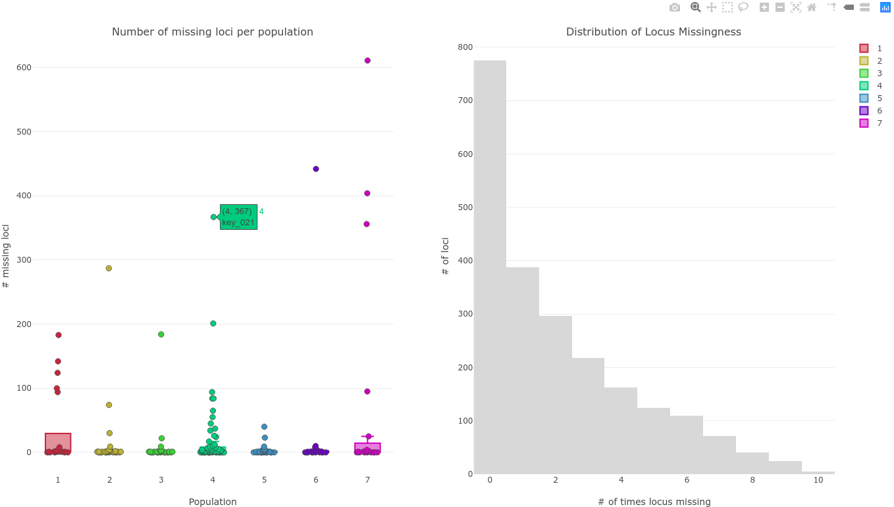
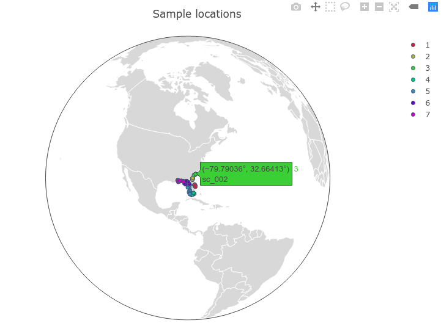

# Plotting

The output of many functions are formatted for use in your favorite Julia plotting environments, such as `Plots`, `Makie`, `PlotlyJS`, `PyPlot`, `Gadfly`, etc. However, some convenience plots are provided to assist with speedy data visualization and exploration. 


## plot missing data

```julia
plot_missing(x::PopObj; color = false)
```
Return an interactive plot of the number of missing loci in individuals of a `PopObj`, along with the number of missing individuals per locus. To set a custom color palette, use `color = [color1, color2, ...]`

Example:

```julia
julia> plot_missing(a)
```




If you would like to save the interactive plot as a local HTML file (does not require Plotly account):

```julia
using PlotlyJS

PlotlyJS.savehtml(plot_missing(a), "filename.html")
```

This will save it in the current working directly as whatever you replace `filename.html` with. If you want the file to work properly offline, add a third option argument `:embed`, although be aware it inflates the file size (~3.5mb for the test data). 

## plot sample locations

    plot_locations(x::PopObj; region = "world", projection = "orthographic")

Returns a simple lower resolution interactive scatterplot of the individuals in a `PopObj`. Default `region` and `projection` are "world" and "orthographic", respectively. If a specific region is set, the plot will default to "mercator" projection unless `projection =` is used to specify a different one.

Example:

```julia
julia> a.latitude = rand(10:30, 212); a.longitude = rand(-99:-80, 212) ;

julia> plot_locations(a)
```




```julia
julia> plot_locations(a, region = "north america", projection = "mercator")`
```


**regions**

- usa
- europe
- asia
- africa
- north america
- south america

**projections**

- equirectangular
- mercator
- orthographic
- natural earth
- kavrayskiy7
- miller
- robinson
- eckert4
- azimuthal equal area
- azimuthal equidistant
- conic equal area
- conic conformal
- conic equidistant
- gnomonic
- stereographic
- mollweide
- hammer
- transverse mercator
- albers usa
- winkel tripel
- aitoff
- sinusoidal

**Saving**

As before, you can save the plot to an HTML file:

```julia
using PlotlyJS

PlotlyJS.savehtml(plot_locations(a, region = "north america", projection = "mercator"), "filename.html")
```